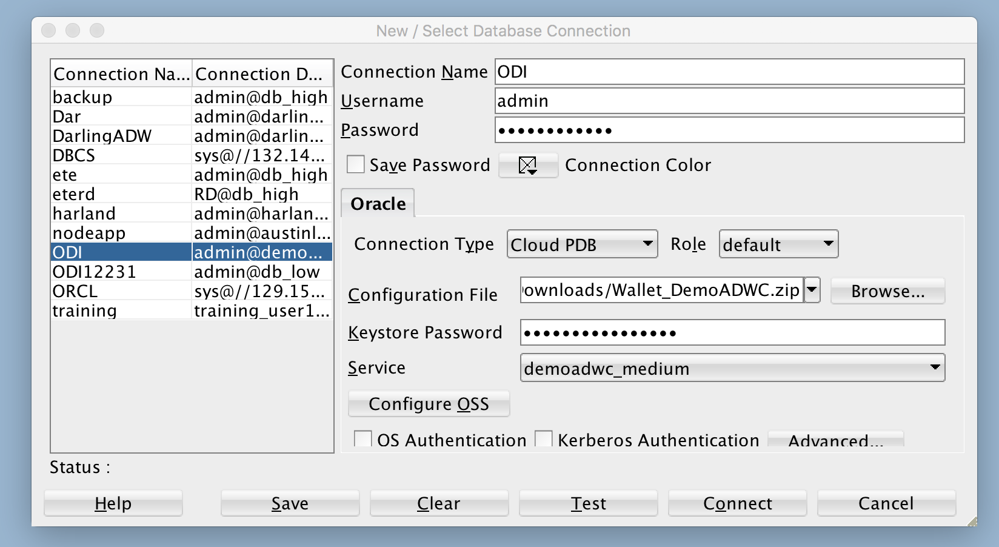
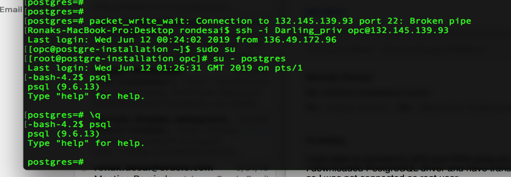
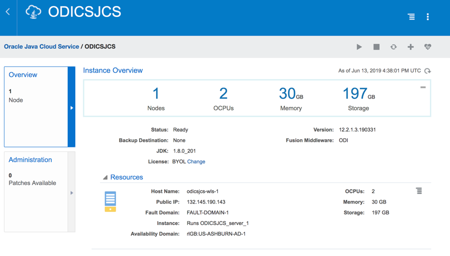
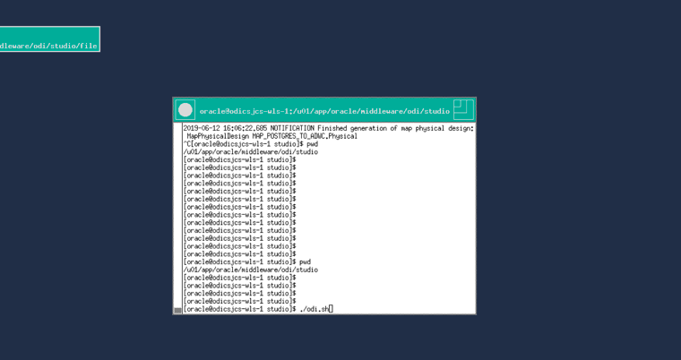
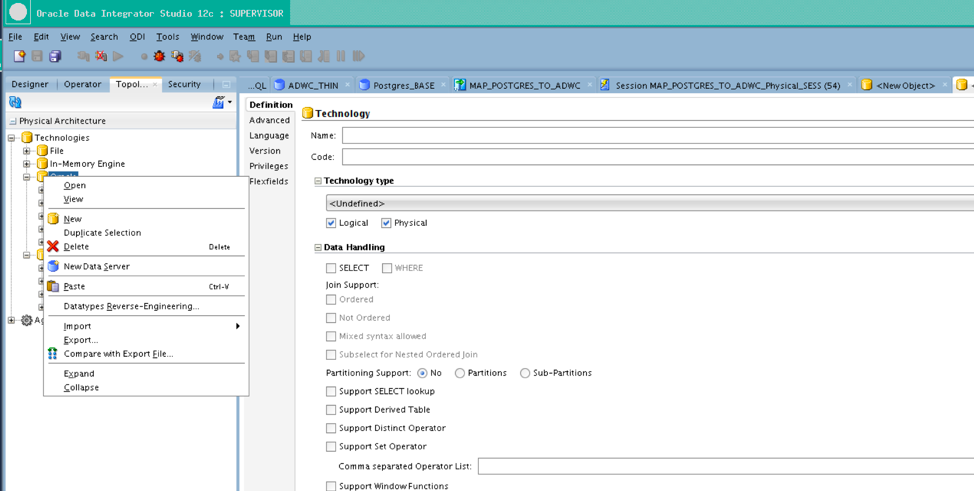
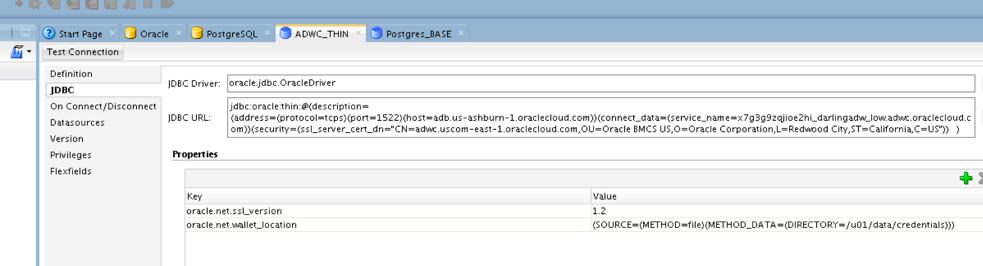
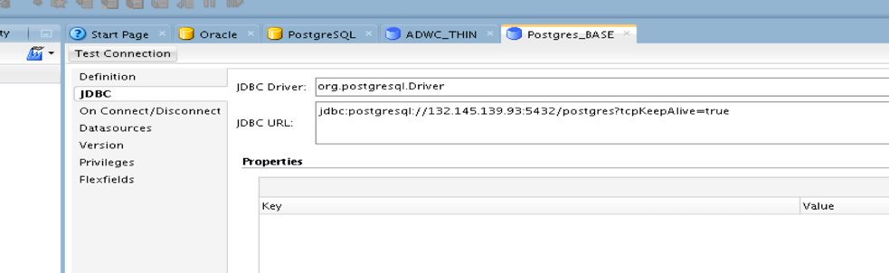
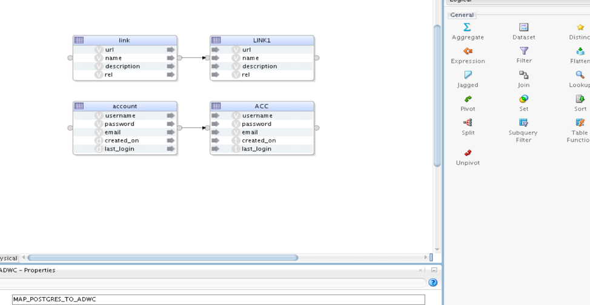
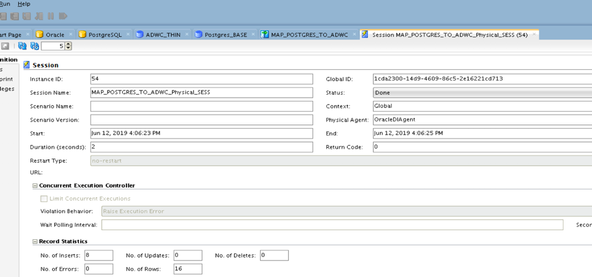

# ODICS data movement to Autonomous Database from PostgreSQL

## Objective

This documents shows you how to move data from PostgreSQL to Autonomous Data Warehouse on Oracle Cloud using Oracle Data Integrator.

Follow this link if you are installing ODICS for the very first time. [ODICS Installation](https://oraclecps.github.io/odi_config_martha/?page=readme.md) or Deploy a market place image

## Pre-requisites

- This lab is written assuming you have installed and have working Oracle Data Integrator.

- The following lab requires an Oracle Public Cloud account with Autonomous Data Warehouse Cloud Service and Java Cloud Service.

- Make sure you have your networking components set up correctly and have assigned all the required policies

    **Edit policies**

        Allow service PSM to inspect vcns in compartment Compartmentname
        Allow service PSM to use subnets in compartment Compartmentname
        Allow service PSM to use vnics in compartment Compartmentname
        Allow service PSM to manage security-lists in compartment Compartmentname
        Allow service PSM to manage all-resources in compartment Compartmentname
        Allow service PSM to inspect autonomous-database in compartment Compartmentname
        Allow service PSM to inspect database-family in compartment Compartmentname

- You need to have a connection to Autonomous Data Warehouse through admin in your SQL Developer.

    - Open up your SQL Developer and create a new connection for admin. If you already have a connection, skip this step.

    - Enter the following details for admin:

        1.	Connection Name: Give any connection name
        2.	Username: admin (or any DB user)
        3.	Password: Password you entered while creating database on cloud
        4.	Connection Type: Cloud PDB
        5.	Configuration File: Path to your wallet
        6.	Keystore Password: Password entered while downloading wallet

        

    - Click on Test, if it shows success, click on save and then click on connect.

    - You would need VNC viewer for ODICS

- You need to have a connection to PostgreSQL database through pgAdmin.
  If it's not, download IDE. [Install pgAdmin](https://www.pgadmin.org/download/)

### **Step 1**: Install PostgreSQL on Oracle Compute.

- If you already have a PostgreSQL up and running, skip this step.

- Login to Oracle cloud

    1. Click on **Left Hamburger menu** and then select **compute**

    2. Deploy a **linux instance** and take note of **IP address**

    3. SSH in to your linux server

          **ssh -i PrivateKey opc@IPaddress**

- Follow this link to install PostgreSQL on Oracle Compute. [Installation of PostgreSQL](https://www.postgresql.org/download/linux/redhat/)

    - **Note**
               Disable Firewall on compute

               Enabled Ingress and Egress Rules for all port including TCP traffic for port: **5432**

               Make sure Postgres server is accessible remotely added listen_addresses = **'*'** to postgresql.conf

               Allow remote IP address to access PostgreSQL in pg_hba.conf

    

- Connect PostgreSQL to pgAdmin

- You can add data into PostgreSQL. By creating schemas and tables (Make sure Target Database has Schema and tables same as source Database)

       CREATE TABLE link (ID serial PRIMARY KEY,url VARCHAR (255) NOT NULL, name VARCHAR (255) NOT NULL, description VARCHAR (255), rel VARCHAR (50));

       INSERT INTO link (url, name) VALUES  ('http://www.oracle.com','Market leading Database management system');

       INSERT INTO link (url, name) VALUES  ('http://www.google.com','Market leading search engine');

       INSERT INTO link (url, name) VALUES  ('http://www.oracle.com','Market leading Database management system');

       INSERT INTO link (url, name) VALUES  ('http://www.google.com','Market leading search engine');

### **Step 2**: Go to ODI studio on Oracle Cloud.

- SSH in to your JCS and install PostgreSQL JDBC driver in JCS

    

- ODICS is installed on JCS, Create a tunnel to your JCS

  **ssh -i key -L 5901:127.0.0.1:5901 opc@132.145.190.143 -N**

- Go to VNC viewer localhost:5901. Start ODI studio ./odi.sh

  

### **Step 3**: Go to Topology in OCI to add connections.

- Before adding connection download and install JDBC driver for PostgreSQL Database.[JDBC driver](https://jdbc.postgresql.org/download.html)

- Install driver on JCS in following folder /u01/app/oracle/middleware/odi/sdk/lib

- Add PostgreSQL and Oracle connection in topology

- Create new data server for Oracle and PostgreSQL

  

-  After creating new connections add JDBC driver and URL for those connections

  

  

- Test Connection and make sure those Connection are successful

- Create mapping between source (PostgreSQL) and Target (ADWC)

- Run the Mapping the to move data from source to Target

  

- You can monitor your jobs in operator tab

  

- Your data would be loaded in ADWC from PostgreSQL

- Go to SQLDeveloper and check if link table is been updated in ADWC and data is in sync with PostgreSQL.
