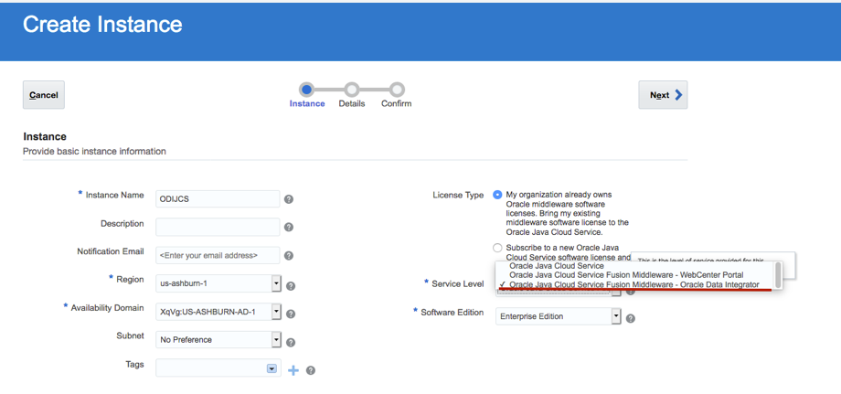

# ODICS data movement to Autonomous Database from PostgreSQL

## Objective

This documents shows you how to move data from PostgreSQL to Autonomous Data Ware House on Oracle Cloud

## Pre-requisites

- The following lab requires an Oracle Public Cloud account with Autonomous Data Warehouse Cloud Service and Java Cloud Service.

- You need to have a connection to database through admin in your SQL Developer.

    - Open up your SQL Developer and create a new connection for admin. If you already have a connection, skip this step.

    - Enter the following details for admin:

        1.	Connection Name: Give any connection name
        2.	Username: admin (or any DB user)
        3.	Password: Password you entered while creating database on cloud.
        4.	Connection Type: Cloud PDB
        5.	Configuration File: Path to your wallet
        6.	Keystore Password: Password entered while downloading wallet.

        

    - Click on Test, if it shows success, click on save and then click on connect.

    - You would need VNC viewer for ODICS

- You need to have a connection to PostgreSQL database through pgAdmin.
  If it's not, download and follow the instructions in this file. [Install pgAdmin](https://www.pgadmin.org/download/)

### **Step 1**: Install PostgreSQL on Oracle Compute.

- Login to Oracle cloud.

    1. Click on **Left Hamburger menu** and then select **compute**.

    2. Deploy a **linux instance** and take note of **IP address**.

    3. SSH in to your linux server.

          **ssh -i PrivateKey opc@IPaddress**

- Follow this link to install PostgreSQL on Oracle Compute. [Installation of PostgreSQL](https://www.postgresql.org/download/linux/redhat/)

    - **Note** Disable Firewall on compute
               Enabled Ingress and Egress Rules for all port including TCP traffic for port: **5432**
               Make sure Postgres server is accessible remotely added listen_addresses = **'*'** to postgresql.conf
               Allow remote IP address to access PostgreSQL in pg_hba.conf

               

- Connect PostgreSQL to pgAdmin

### **Step 2**: Installation of ODI studio on Oracle Cloud.

- To install **ODI Studio** you would need a Database and Java Cloud Service (JCS)

- Follow this link if you are installing ODICS for the very first time[ODICS Installation](https://oraclecps.github.io/odi_config_martha/?page=readme.md)

### Create Database (Dbaas)

- Click on left hamburger menu and select Bare Metal, VM, and Exadata

- Deploy a Dbaas instance ( Make a note of your username password and IP address )

- Once Database is created you need to update policies so that JCS can detect Database

**Edit policies**

    **Allow service PSM to inspect vcns in compartment Compartmentname
Allow service PSM to use subnets in compartment Compartmentname
Allow service PSM to use vnics in compartment Compartmentname
Allow service PSM to manage security-lists in compartment Compartmentname
Allow service PSM to manage all-resources in compartment Compartmentname
Allow service PSM to inspect autonomous-database in compartment Compartmentname
Allow service PSM to inspect database-family in compartment Compartmentname**

### Create Java Cloud Service(JCS)

- Go to Oracle dashboard and Select Java

- Make sure to select service level as Oracle Data Integrator while deploying

- Once JCS is up and running take note of IP address and download JDBC driver.[JDBC driver](https://jdbc.postgresql.org/download.html)

- SSH in to your JCS and install PostgreSQL JDBC driver in JCS.

- Install driver in following folder /u01/app/oracle/middleware/odi/sdk/lib

- Once ODICS is installed on JCS, Create a tunnel to your JCS

  **ssh -i Darling_priv -L 5901:127.0.0.1:5901 opc@132.145.190.143 -N**

- Go to VNC viewer localhost:5901. Start ODI studio ./odi.sh

### **Step 3**: Run the application.

- Set environment variable "FLASK_APP" to the path of the app.py

  **export FLASK_APP=path to app.py**

- Type following command in command line:

  **flask run --host=0.0.0.0 --port=5000**

- Now open any web browser and type **"localhost:5000/channels"**

  You will see channels information on the browser.

  You can also deploy this application in a compute instance and can use the REST API in SaaS Applications.
